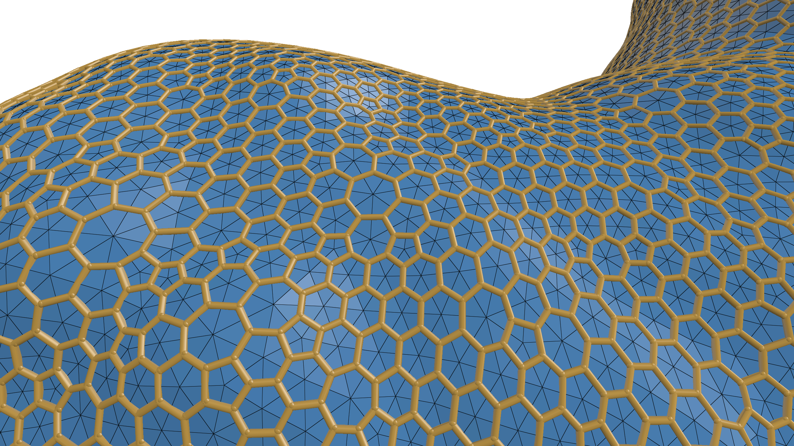

A _parameterization_ is a set of 2D coordinates associated with a mesh, often referred to as a "UV map". This sections details several functions for visualizing such parameterizations.


**Example**: drawing mesh's dual with [geometry-central](../../../integrations/geometry_central/).



```cpp
TODO example
```

## Options

### Styles

Several styles are available for how a parameterization is displayed. 

The function `SurfaceParameterizationQuantity::setStyle(ParamVizStyle newStyle)` can be used to programmatically change the style.

## Adding


??? func "`#!cpp SurfaceMesh::addSurfaceGraphQuantity(std::string name, const P& nodes, const E& edges)`"

    Add a new surface graph quantity to the structure. 

    - `nodes` is the list of 3D positions for the graph nodes. The type should be [adaptable](../../../basics/array_adaptors) to a list of `float`-valued 3-vectors.
    - `edges` is the list of edges for the graph, where each entry is two 0-based indices in to the `nodes` array. The type should be [adaptable](../../../basics/array_adaptors) to a list of `size_t`-valued 2-vectors (aka pairs of indices).

    The resulting class has `color` and `radius` fields which can be set to adjust the appearance of the resulting graph.
