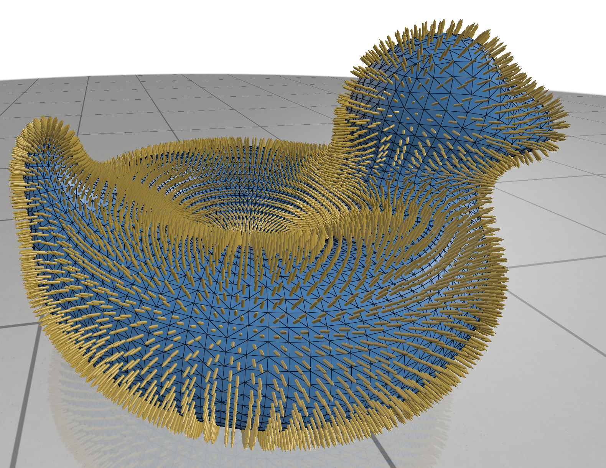

Visualize vector-valued data at the elements of a surface mesh.

### Ambient vectors

_Ambient_ vectors are "standard" vectors, which have X-Y-Z vector coordinates in world space.

??? func "`#!cpp SurfaceMesh::addVertexVectorQuantity(std::string name, const T& vectors)`"

    Add a vector quantity defined at the vertices of the mesh.

    - `vectors` is the array of vectors at vertices. The type should be [adaptable](/data_adaptors) to a 3-vector array of `float`s. The length should be the number of vertices in the mesh.
    - `vectorType` indicates how to interpret vector data. The default setting is as a freely-scaled value, which will be automatically scaled to be visible. Passing `VectorType::AMBIENT` ensures vectors have the proper world-space length.
    
    Note: the inner vector type of the input _must_ be 3D dimensional, or you risk compiler errors, segfaults, or worse. If you want to add 2D vectors (usually to a 2D mesh), `addVertexVectorQuantity2D` exists with the same signature. See [2D data](/features/2D_data).

??? func "`#!cpp SurfaceMesh::addFaceVectorQuantity(std::string name, const T& vectors)`"

    Add a vector quantity defined at the faces of the mesh.

    - `vectors` is the array of vectors at faces. The type should be [adaptable](/data_adaptors) to a 3-vector array of `float`s. The length should be the number of vertices in the mesh.
    - `vectorType` indicates how to interpret vector data. The default setting is as a freely-scaled value, which will be automatically scaled to be visible. Passing `VectorType::AMBIENT` ensures vectors have the proper world-space length.

    Note: the inner vector type of the input _must_ be 3D dimensional, or you risk compiler errors, segfaults, or worse. If you want to add 2D vectors (usually to a 2D mesh), `addFaceVectorQuantity2D` exists with the same signature. See [2D data](/features/2D_data).

### Tangent vectors

_Tangent_ vectors lie flat against the surface of the mesh. The are expressed as 2D vectors with X-Y coordinates in some basis frame at the mesh element.

??? func "`#!cpp SurfaceMesh::addVertexIntrinsicVectorQuantity(std::string name, const T& vectors, int nSym=1)`"

    Add a tangent vector quantity defined at the vertices of the mesh.

    - `vectors` is the array of vectors at vertices. The type should be [adaptable](/data_adaptors) to a 2-vector array of `float`s. The length should be the number of vertices in the mesh.
    - `nSym` is a symmetry order for visualiztion line field (n = 2) and cross field (n = 4), etc. If it is set to a non-`1` value, n distinct vectors will be displayed at each element. This function presumes a "power"-representation for symmetric fields, which the inputs result from raising symmetric vectors to the n'th power.

    The vectors will be interpreted in the basis of `SurfaceMesh::vertexTangentSpaces`. These tangent spaces can be manually specified with (TODO).

??? func "`#!cpp SurfaceMesh::addFaceIntrinsicVectorQuantity(std::string name, const T& vectors, int nSym=1)`"

    Add a tangent vector quantity defined at the faces of the mesh.

    - `vectors` is the array of vectors at faces. The type should be [adaptable](/data_adaptors) to a 2-vector array of `float`s. The length should be the number of faces in the mesh.
    - `nSym` is a symmetry order for visualiztion line field (n = 2) and cross field (n = 4), etc. If it is set to a non-`1` value, n distinct vectors will be displayed at each element. This function presumes a "power"-representation for symmetric fields, which the inputs result from raising symmetric vectors to the n'th power.

    The vectors will be interpreted in the basis of `SurfaceMesh::facesTangentSpaces`. These tangent spaces can be manually specified with (TODO).

### One forms

_One forms_ are tangent vector-like quantites represented as integrated scalars along edges. The commonly arise, for example, as a gradient which is difference of scalar values at vertices.

??? func "`#!cpp SurfaceMesh::addFaceIntrinsicVectorQuantity(std::string name, const T& data, const O& orientations)`"

    Add a one-form quantity via a scalar at edges, which will be shown like a vector field.

    - `data` is the array of scalars at edges. The type should be [adaptable](/data_adaptors) to an array of `float`s. The length should be the number of edges in the mesh.
    - `orientations` 1-forms are defined with respect to an orientation of edges, so you need to tell Polyscope which direction your edges point in. This input is an array of booleans at edges. The type should be [adaptable](/data_adaptors) to an array of `char`s (because `std::vector<bool>` is broken). The length should be the number of edges in the mesh. These booleans should be `true` if the edge points from the lower indexed adjacent vertex to the higher-indexed vertex, and false otherwise.

